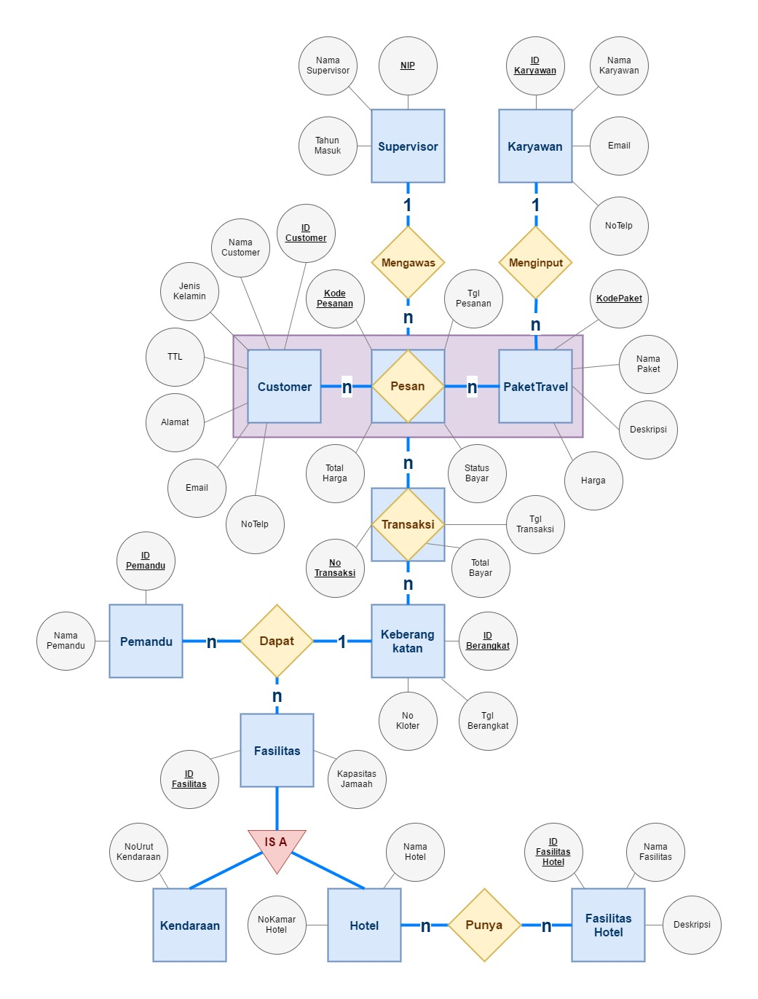
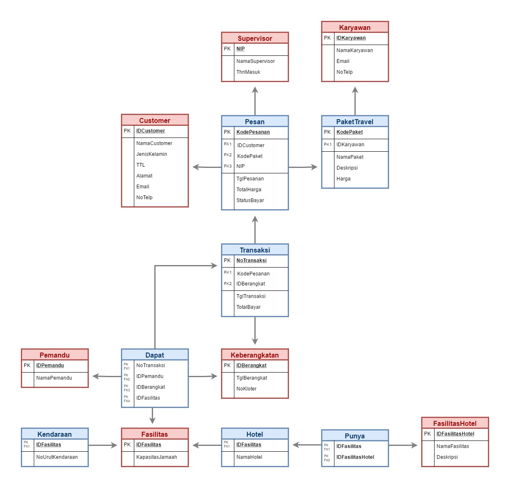

# Pemodelan Database Perusahaan Jasa Travel : Umroh Priority

:one: Tentang
-------------
* Judul Pemodelan : Jasa Travel Umroh Priority
* Mata Kuliah : Pemrograman Basis Data (PBD)
* Bahasa : DDL, DML, Query
* Software : Oracle SQL Developer
* Platform : Desktop
* Kontribusi Saya : Menyeluruh

:two: Proses Bisnis
-------------------
Suatu perusahaan jasa travel umroh bernama UmrohPriority menyediakan paket travel perjalanan umroh, dengan ragam harga tertentu sesuai paket yang dipilih. Customer dapat memesan paket travel sesuai kehendaknya, dan selanjutnya melakukan transaksi untuk mendapatkan informasi/info keberangkatannya. Customer mendapatkan fasilitas berupa kendaraan, hotel dan pemandu travel umroh dari karyawan perusahaan UmrohPriority. Selain itu, adapula Supervisor yang bertugas mengawasi proses transaksi customer.

:three: Aturan Bisnis
---------------------
1.	Karyawan  menginputkan paket travel satu atau lebih (yang nanti akan dipilih oleh customer), dan satu atau lebih paket travel diinputkan oleh satu karyawan yang bertugas.
2.	Banyak customer dapat memesan banyak paket travel, dan banyak paket travel dapat dipesan oleh banyak customer.
3.	Proses pemesanan paket oleh customer diawasi oleh satu orang supervisor.
4.	Setelah customer memesan paket travel (agregasi), selanjutnya customer melakukan transaksi untuk mendapatkan info keberangkatan, dan banyak dari info keberangkatan hasil dari banyak pesanan customer.
5.	Satu info keberangkatan customer mendapatkan banyak fasilitas dan pemandu travel.
6.	Fasilitas terdiri dari kendaraan dan hotel. 
7.	Hotel terdiri dari fasilitas hotel.

:four: ERD
----------

:five: Skema Relasi
-------------------

